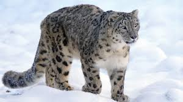

<!DOCTYPE html>
<html lang="de">
<head>
    <meta charset="UTF-8">
    <meta name="viewport" content="width=device-width, initial-scale=1.0">
    <title>Schneeleoparden und Klimawandel</title>
    
</head>
<body>
    <header>
        <h1>Schneeleoparden und der Klimawandel</h1>
        
Wie die Erderwärmung das Leben der Geister der Berge verändert

    </header>

    <nav>
        <a href="#steckbrief">Steckbrief</a>
        <a href="#lebensraumveränderung">Lebensraumveränderung</a>
        <a href="#schutzmaßnahmen">Schutzmaßnahmen</a>
    </nav>

    <section id="steckbrief" class="intro">
        <h2>Steckbrief: Schneeleopard (Panthera uncia)</h2>
        

            <strong>Lebensraum:</strong> Hochgebirge Zentralasiens (Himalaya, Karakorum, Altai, Pamir) in Höhenlagen von 2.500–5.500 m. 
            <strong>Größe:</strong> Körperlänge 90–120 cm, Schwanz bis zu 100 cm, Gewicht 27–55 kg. 
            <strong>Merkmale:</strong> Dichter, grauweißer Pelz mit schwarzen Flecken und Rosetten, langer Schwanz zur Balance, breite Pfoten für den Schnee. 
            <strong>Ernährung:</strong> Fleischfresser; Beute sind z. B. Blauschafe, Steinböcke und kleinere Säugetiere. 
            <strong>Bedrohung:</strong> Durch Lebensraumverlust, Wilderei und abnehmende Beutetiere gefährdet (IUCN: „Vulnerable“).
        

    </section>

    <section id="lebensraumveränderung">
        <h2>Lebensraumveränderung durch den Klimawandel</h2>
        
Der Klimawandel wirkt sich auf den Lebensraum des Schneeleoparden aus:

        <ul>
            <li><strong>Schrumpfen der Hochgebirgsregionen:</strong> Steigende Temperaturen führen dazu, dass sich Wälder und Weideflächen höher ausbreiten, wodurch der Lebensraum des Schneeleoparden kleiner wird.</li>
            <li><strong>Verlust von Beutetieren:</strong> Veränderungen der Vegetation und des Klimas können die Bestände von Beutetieren wie Blauschafen und Steinböcken verringern.</li>
            <li><strong>Verdrängung durch andere Arten:</strong> Höhere Temperaturen könnten andere Raubtiere (z. B. Leoparden) in höhere Gebiete bringen, die dann mit Schneeleoparden konkurrieren.</li>
            <li><strong>Zunahme von Mensch-Wildtier-Konflikten:</strong> Durch die Ausbreitung landwirtschaftlicher Flächen in höhere Lagen steigt die Wahrscheinlichkeit von Konflikten mit Hirten, etwa durch Angriffe auf Vieh.</li>
        </ul>
        
        

            Der Schneeleopard ist gezwungen, höher gelegene und isoliertere Gebiete aufzusuchen, was seine Überlebensfähigkeit zusätzlich erschwert.
        

    </section>

    <section id="schutzmaßnahmen" class="content">
        <h2>Was können wir tun?</h2>
        
Um den Schneeleoparden zu schützen, sind folgende Maßnahmen wichtig:

        <ul>
            <li>Schutz und Wiederherstellung seines Lebensraums.</li>
            <li>Reduzierung von Wilderei und illegalem Handel.</li>
            <li>Förderung nachhaltiger Landwirtschaft in Hochgebirgsregionen.</li>
            <li>Unterstützung von Naturschutzprogrammen und Aufklärung der Bevölkerung.</li>
        </ul>
    </section>

    <footer>
        
&copy; 2024 - Bewusst leben für die Natur

    </footer>
</body>
</html>
